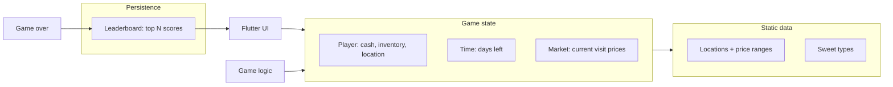

# SweetStall – Text-Based Sweet Trading Game

## Game design summary

- **Role**: Player is a sweet trader with starting cash and a time limit (e.g. in-game days).
- **Locations**: Multiple places (e.g. school, park, market). Each location has **per-sweet** min/max **buy** and **sell** prices. Visiting a location rolls random prices from those ranges for the current visit.
- **Loop**: Travel to a location → see current buy/sell prices → buy sweets (spend cash) or sell sweets (earn cash) → travel elsewhere or end day → time decreases → repeat until time = 0.
- **Goal**: Maximize money before time runs out. Game over when time hits 0; final score = money (and optional rank).
- **Persistence (from start)**: Simple **high score / leaderboard** stored locally (e.g. top N scores with optional player name). Shown on home screen and after game over; new score submitted when game ends.

---

## Architecture (high level)



- **Static data**: Locations (name, per-sweet buy/sell ranges) and sweet types. Load once or from config/JSON.
- **Game state**: Player (cash, inventory, current location), remaining time, current market (random buy/sell prices for current location).
- **Game logic**: Move (advance time, roll prices), buy, sell, advance time; game over when time = 0.
- **Leaderboard**: Local storage (e.g. `shared_preferences` or JSON file). Top N entries (e.g. score + optional name). Load on app start; save when game ends if score qualifies. Display on home screen and game over screen.

---

## Tech stack

| Layer | Choice | Notes |
|-------|--------|--------|
| Framework | Flutter (latest stable) | iOS + Android. |
| Language | Dart 3.x | Align with Flutter SDK. |
| Game engine | None | Text-based UI; standard Flutter widgets. |
| State management | Provider or Riverpod | Player, time, market, locations. |
| Persistence | shared_preferences (or JSON file) | Leaderboard only: store list of `{ score, name?, date? }`, sort by score, keep top N (e.g. 10). |
| Dev environment | Dev container | Flutter + Android SDK; iOS built on host Mac or CI. |

---

## Dev container and iOS caveat

- **Dev container**: Linux-based; Flutter SDK + Android SDK. Consistent tooling on Windows/Linux/macOS for Android (and web) development.
- **iOS**: Xcode runs only on macOS. Build/run iOS on host Mac or via CI; same Flutter project, different execution environment.

---

## Project structure

```
SweetStall/
├── .devcontainer/
│   ├── devcontainer.json
│   └── Dockerfile
├── lib/
│   ├── main.dart
│   ├── app.dart
│   ├── models/
│   │   ├── location.dart
│   │   ├── sweet.dart
│   │   ├── player.dart
│   │   ├── market.dart
│   │   └── leaderboard_entry.dart   # score, optional name, optional date
│   ├── data/
│   │   └── game_data.dart
│   ├── game/
│   │   ├── game_state.dart
│   │   └── game_actions.dart
│   ├── services/
│   │   └── leaderboard_service.dart # load/save top N, add score, get list
│   ├── screens/
│   │   ├── home_screen.dart         # Start game + show leaderboard
│   │   ├── play_screen.dart
│   │   └── game_over_screen.dart    # Final score + submit to leaderboard + show leaderboard
│   └── widgets/
├── pubspec.yaml                     # Flutter, provider/riverpod, shared_preferences
├── README.md
└── (iOS/Android from flutter create)
```

---

## Core implementation details

1. **Locations and price ranges**  
   Each location: id and map `sweetId → { buyMin, buyMax, sellMin, sellMax }`. On enter (or per visit), fill current market by sampling from these ranges.

2. **Time**  
   Integer “days left”. Travel or end day decrements it. At 0 → game over; show final cash as score.

3. **Buy / sell**  
   Validate in game logic; update player cash and inventory from market prices.

4. **Leaderboard (persistence from start)**  
   - **Model**: e.g. `LeaderboardEntry(score, name?, date?)`.  
   - **Storage**: `shared_preferences` – store JSON list of entries (or encode list to string). Alternatively a single JSON file in app documents dir.  
   - **Logic**: On load, parse and sort by score descending; keep top N (e.g. 10). When game ends, if score qualifies (e.g. in top N or above lowest), optionally prompt for name, then insert, re-sort, trim to N, save.  
   - **UI**: Home screen shows top scores (e.g. “Best scores”); game over screen shows “Your score: X”, “High scores” list, and optionally “Enter name” if score made the list.

5. **UI flow**  
   - **Home**: “Start game” + “High scores” list.  
   - **Play**: Location, market, inventory, travel/buy/sell.  
   - **Game over**: Final score, submit to leaderboard (if applicable), show leaderboard, button back to home.

---

## Implementation order (todos)

1. **Bootstrap Flutter project** – `flutter create`; add `provider` or `riverpod`, `shared_preferences` in `pubspec.yaml`.
2. **Add dev container** – `.devcontainer/` with Dockerfile (Flutter + Android SDK) and `devcontainer.json`; document iOS on host/CI.
3. **Define models and data** – Sweet, Location, Player, Market, LeaderboardEntry; `game_data.dart` with locations and sweets.
4. **Implement leaderboard service** – Load/save top N from `shared_preferences` (or file); add score, get sorted list; `LeaderboardEntry` model.
5. **Implement game state and actions** – Single source of truth for player, time, market; actions: setLocation + roll prices, buy, sell, advance time; game over when time = 0.
6. **Build main UI** – Home (start + leaderboard), Play (location, market, inventory, travel/buy/sell), Game over (score, submit to leaderboard, show leaderboard, back to home).
7. **Tune and document** – Balance time/cash/prices; README with run instructions and dev container + iOS notes.

---

## Out of scope for initial plan

- Save/load full game state (only leaderboard persistence).
- Sound or graphics (text-based).
- iOS build inside dev container (use host Mac or CI).
